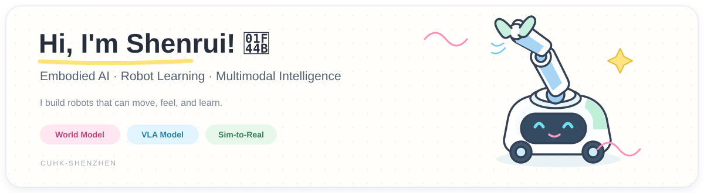
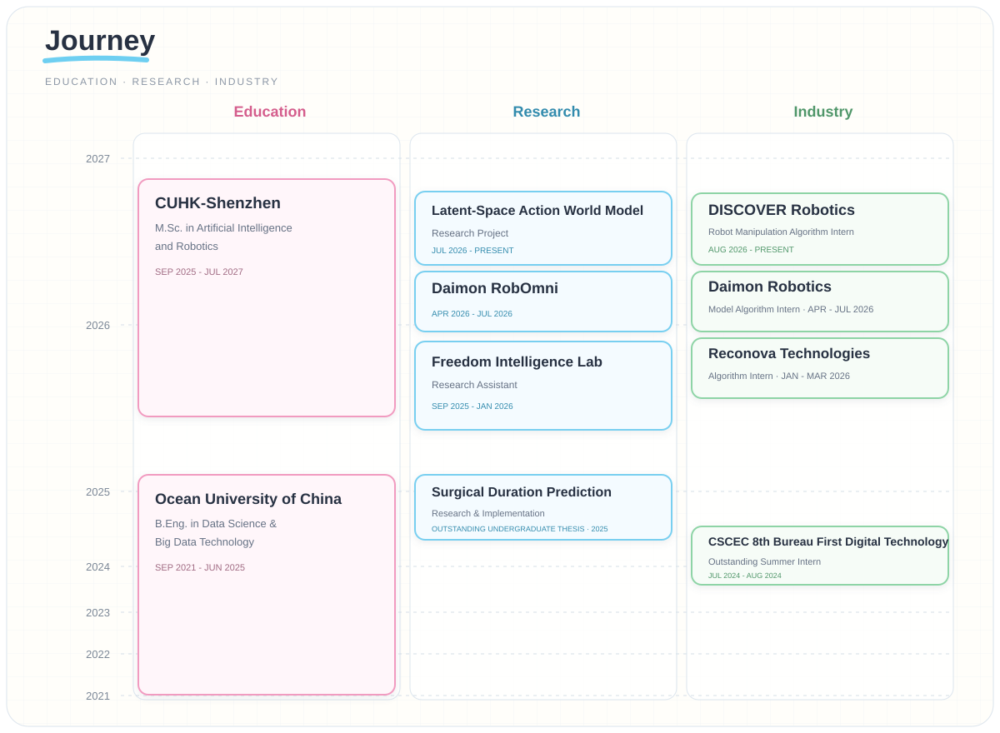
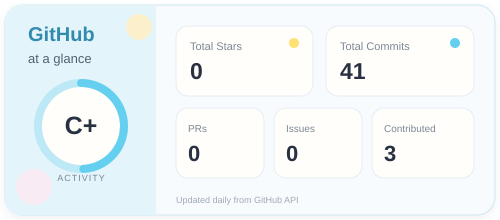
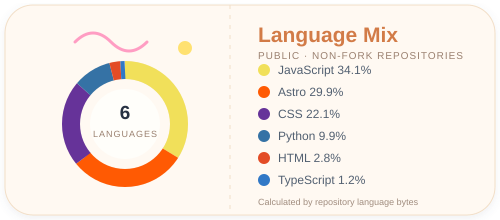

<div align="center">
  
</div>

<div align="center">
  
  <br />
  <sub><a href="mailto:225040220@link.cuhk.edu.cn">Email me</a> · <a href="https://github.com/fengzheng-kite">View my GitHub</a></sub>
</div>

## About Me

I am **Shenrui Liu**, an M.Sc. student in Artificial Intelligence and Robotics at **The Chinese University of Hong Kong, Shenzhen**. My work sits at the intersection of embodied intelligence, robot learning, and multimodal perception.


```python
shenrui = {
    "focus": ["Embodied AI", "Robot Learning", "Multimodal Perception"],
    "research": ["Vision-Language-Action", "World Models", "Sim-to-Real"],
    "currently_building": "generalizable robot intelligence",
}
```

## Creative Playground

Beyond research, I occasionally ship small, curious projects - tiny tools, playful prototypes, and fresh experiments inspired by everyday ideas.

> In the age of AI, every spark of inspiration deserves a fast path from idea to reality.

## Research Orbit

<table>
  <tr>
    <td width="33%" align="center">
      <h3>🖐️ Tactile Intelligence</h3>
      Contact-rich manipulation with unified tactile and visual representations.
    </td>
    <td width="33%" align="center">
      <h3>🤖 Robot Learning</h3>
      VLA policies, imitation learning, reinforcement learning, and robust evaluation.
    </td>
    <td width="33%" align="center">
      <h3>🌐 Sim-to-Real</h3>
      Scalable simulation, synthetic data generation, and real-world transfer.
    </td>
  </tr>
</table>

## Journey

<div align="center">
  
</div>

## Featured Work

### Daimon RobOmni

A multimodal benchmark and research platform for contact-rich robotic manipulation. My work includes simulation asset construction, interactive data pipelines, policy evaluation, and standardized tactile-visual observations across robot embodiments.

- Built reproducible manipulation environments and data collection workflows in NVIDIA Isaac Sim / Isaac Lab.
- Developed model-agnostic evaluation interfaces for policies such as ACT and π0.5.
- Worked on tactile-visual representation, robot asset tooling, and large-scale benchmark engineering.


## Tech Constellation

<div align="center">
  
  <br />
  
  
  
  
</div>

## GitHub Signal

<div align="center">
  
  
</div>

<div align="center">
  
</div>

<div align="center">
  
  <br />
  <sub>Open to research conversations and collaborations in embodied intelligence.</sub>
</div>

<!-- profile-readme -->
